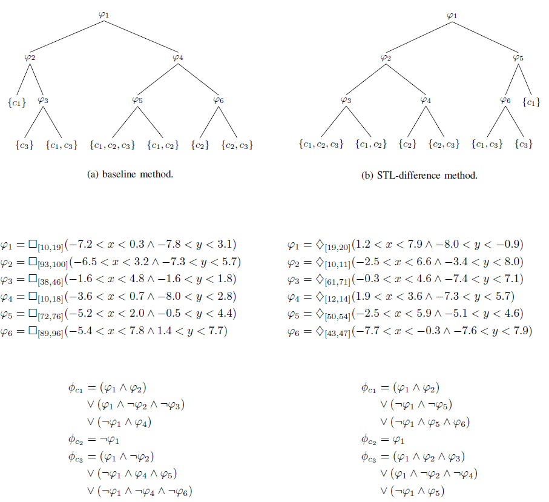

# Specifications of Human-Robot Encounters: Learning STL formulae in a Multi-Label Multi-Class Approach
Dataset and code to formalize trajectories in human-robot encounters, where trajectories can present multiple labels


## Will be moved to planiacs repo!


## Introduction

We are interested in formalizing human trajectories in human-robot encounters.
Typically, STL inference methods learn from data partitioned between negative and positive instances.
However, these methods do not account for cases where the positive data can contain several classes of pre-identified behaviors.
We propose a decision tree-based algorithm to extract STL formulae from multi-labelled data.
We apply our method to a dataset of trajectories collected through an online study where participants had to avoid colliding with a robot in a shared environment. The human participants described different behaviors, ranging from being in a hurry/minimizing completion time to maximizing safety.


## Downloading sources

You can use this API by cloning this repository:
```
$ git clone https://github.com/allinard/stl_multiclass
```

Dependencies:
* Python 3.8
	* numpy
	* matplotlib
	* scipy
	* sklearn
	* dill
	* pandas
	* Pulp
* Gurobi MILP Solver


## Inference of multiclass STL formulae

Will be posted soon.


## Experiments

You will find here 2 experiments we ran on 2 different datasets.

### Synthetic dataset

In this experiment, we generated 500 trajectories given generated STL specifications. We considered


and the following classes of trajectories:


Since we consider the multi-class and multi-label case, trajectories could be labelled as {c1}, {c2}, {c3}, {c1, c2}, {c1, c3}, {c2, c3} and {c1, c2, c3}. We generated trajectories from specifications of different (combinations of) classes using an MILP approach and the Gurobi optimizer.
We generated 100 trajectories for each of the classes {c1}, {c2} and {c3}, and 50 trajectories for each of the remaining classes {c1, c2}, {c1, c3}, {c2, c3} and {c1, c2, c3}. Here are example trajectories for each of the classes:


We evaluated our methods over these classes by cross-validation (on 5 folds), for of our baseline (dt), and STL-difference (dtΔ) methods comparedto a classical neural networks approach (nn), where H represents the results in terms of hamming loss, and A the results in terms of example accuracy:


Finally, we could learn the following models:




### User study data on human-robot encounters

We ran experiments on a dataset of trajectories collected through an online study where participants had to avoid colliding with a robot in a shared environment, and where the participants depicted 3 behaviors: being in a hurry, taking a normal walk, or maximizing safety.


## Publications

You can find hereinafter the related publication f<or more details on the implemented methods:
* TBD/Submitted
