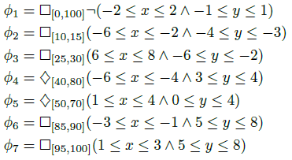
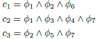
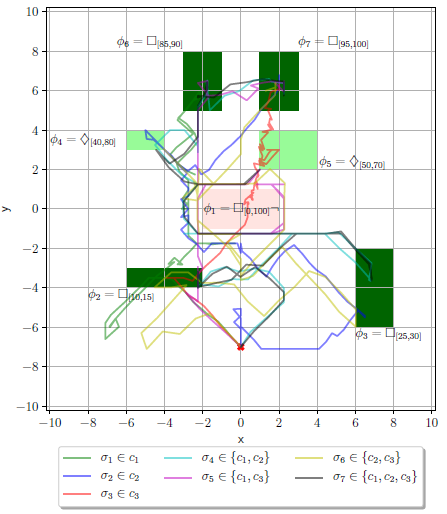
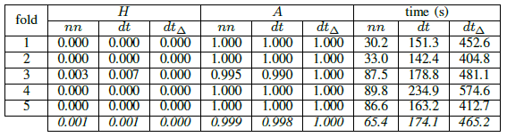
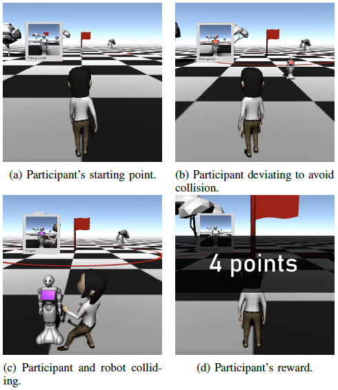
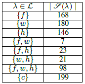
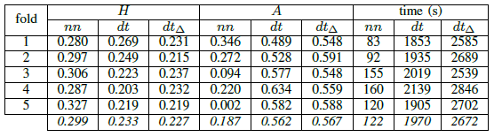
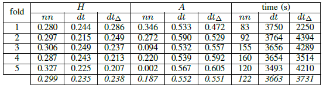
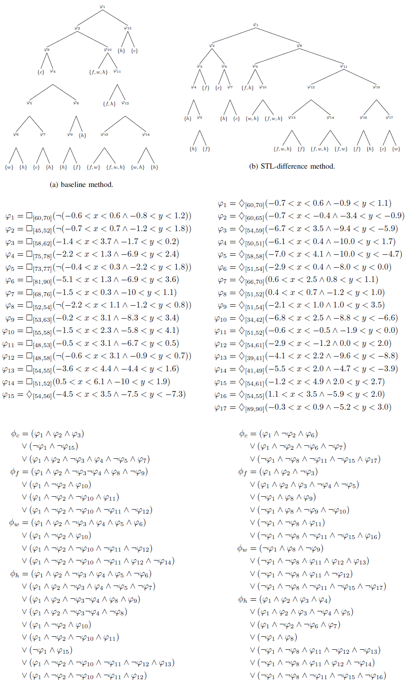
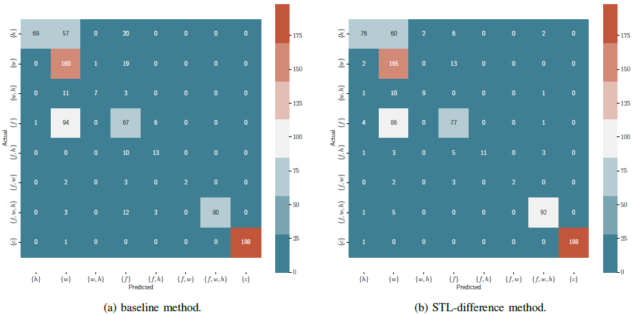

# Inference of Multi-Class STL Specifications for Multi-Label Human-Robot Encounters
Dataset and code to formalize trajectories in human-robot encounters, where trajectories can present multiple labels


## Introduction

We are interested in formalizing human trajectories in human-robot encounters.
Typically, STL inference methods learn from data partitioned between negative and positive instances.
However, these methods do not account for cases where the positive data can contain several classes of pre-identified behaviors.
We propose a decision tree-based algorithm to extract STL formulae from multi-labelled data.
We apply our method to a dataset of trajectories collected through an online study where participants had to avoid colliding with a robot in a shared environment. The human participants described different behaviors, ranging from being in a hurry/minimizing completion time to maximizing safety.


## Downloading sources

You can use this API by cloning this repository:
```
$ git clone https://github.com/KTH-RPL-Planiacs/stl_multiclass
```

Dependencies:
* Python 3.8
	* numpy
	* matplotlib
	* scipy
	* sklearn
	* dill
	* pandas
	* Pulp
* Gurobi MILP Solver


## Inference of multiclass STL formulae

The module `learn_multiclass_stl.py` implements the learning of multiclass STL formulae from data.

```
dtlearn = DTLearn(dict_trajectories, 
				  dict_trajectories_classes, 
				  list_classes,
				  min_x, 
				  min_y, 
				  min_h, 
				  max_x, 
				  max_y, 
				  max_h, 
				  max_depth,
				  stl_diff,
				  verbose)
tree = dtlearn.recursiveGenerateTree(train_trajectories)
```
Which first instantiates a `DTLearn` object:
* `dict_trajectories`: python dict identifying trajectoryID as key, and trajectories as value. A trajectory is a list of values [x_val,y_val], where each list of value represents the value of a trajectory at a given discrete time.
* `dict_trajectories_classes`: python dict identifying trajectoryID as key, and list of classes as value.
* `list_classes`: list of the different classes trajectories can belong to.
* `min_x`: lowerbound of trajectories' values on the x-axis (or lowerbound search of specifications on the x-axis).
* `min_y`: lowerbound of trajectories' values on the y-axis (or lowerbound search of specifications on the y-axis).
* `min_h`: lowerbound of target specifications' horizon.
* `max_x`: upperbound of trajectories' values on the x-axis (or upperbound search of specifications on the x-axis).
* `max_y`: upperbound of trajectories' values on the y-axis (or upperbound search of specifications on the y-axis).
* `max_h`: upperbound of target specifications' horizon.
* `max_depth` (optional): termination criterion -- the maximum depth of the decision tree (default set to `5`).
* `stl_diff` (optional): if uses the STL difference based prunning of the decision tree nodes (default set to `True`). Enables to render more concise STL formulae.
* `verbose` (optional): print details on the execution of the algorithm (default set to `False`).

Then calls the `recursiveGenerateTree` function, which learns a multiclass STL specification given a set of trajectories `train_trajectories`:
* `train_trajectories`: list of trajectoryID in `dict_trajectories` you want to train your STL formula on.

To display the learned STL decision tree, call the following function:
```
DTLearn.to_string(tree)
```

To display the STL formula for a given class, call the following function, where `class_number` is the class you want to return the STL specification:
```
printRootToLeafPath(tree, class_number)
```


### CLI

The module `learn_multiclass_stl.py` can also be run in a command line:

```
python learn_multiclass_stl.py --dicttrajectories <dict_trajectories> --dicttrajectoriesclasses <dict_trajectories_classes> --listclasses <list_classes> --minx <min_x> --miny <min_y> --minh <min_h> --maxx <max_x> --maxy <max_y> --maxh <max_h> --maxdepth <max_depth> --stldiff <stl_diff> --verbose <verbose> --cm <cm> --outputmodel <output_model>
```

where the `--cm` option commands whether to display or not the confusion matrix of the true labels vs. the predicted ones, and the `--outputmodel` option the path to output the multiclass STL formula.


### Evaluation

```
y_true, y_pred = evaluate(tree, dict_trajectories_classes, dict_trajectories, list_classes)
hamming_loss(np.array(y_true), np.array(y_pred))
example_based_accuracy(np.array(y_true), np.array(y_pred))
```

We provide 2 implementations for the evaluation of the multi class STL models. The `hamming_loss` function returns the percentage of incorrectly predicted labels to the total number of labels. The `example_based_accuracy` function returns the proportion of correctly predicted labels to the total number of labels.
Further, the `evaluate` function returns the true labels and the predicted labels of given trajectories.
* `tree`: the learned multiclass STL decision tree.
* `dict_trajectories`: python dict identifying trajectoryID as key, and trajectories as value. A trajectory is a list of values [x_val,y_val], where each list of value represents the value of a trajectory at a given discrete time.
* `dict_trajectories_classes`: python dict identifying trajectoryID as key, and list of classes as value.
* `list_classes`: list of the different classes trajectories can belong to.


## Experiments

You will find here 2 experiments we ran on 2 different datasets.

### Synthetic dataset

In this experiment, we generated 500 trajectories given generated STL specifications. We considered



and the following classes of trajectories:



Since we consider the multi-class and multi-label case, trajectories could be labelled as {c1}, {c2}, {c3}, {c1, c2}, {c1, c3}, {c2, c3} and {c1, c2, c3}. We generated trajectories from specifications of different (combinations of) classes using an MILP approach and the Gurobi optimizer. The code for the trajectory generation can be found in `synthetic_data/STLGenerateSignal_syntheticdata.py`.
We generated 100 trajectories for each of the classes {c1}, {c2} and {c3}, and 50 trajectories for each of the remaining classes {c1, c2}, {c1, c3}, {c2, c3} and {c1, c2, c3}. The trajectories we generated can be found in `synthetic_data/processed_classes`:
* `dict_classes_trajectory.pkl`: pickle object containing a python dict identifying classID as key, and trajectoryID as value.
* `dict_trajectories.pkl`: pickle object containing a python dict identifying trajectoryID as key, and trajectories as value. A trajectory is a list of values [x_val,y_val], where each list of value represents the value of a trajectory at a given discrete time.
* `dict_trajectories_classes.pkl`: pickle object containing a python dict identifying trajectoryID as key, and list of classes as value.
* `list_classes.pkl`: pickle object containing a list of the different classes trajectories can belong to.


Here are example trajectories for each of the classes:



We evaluated our methods over these classes by cross-validation (on 5 folds), for of our baseline (dt), and STL-difference (dtΔ) methods compared to a classical neural networks approach (nn), where H represents the results in terms of hamming loss, and A the results in terms of example accuracy:



Finally, we could learn the following models:


The cross-validation models can be found in `synthetic_data/cv/nn` for each fold nn-learned model, and `synthetic_data/cv/stl_dt` for each fold mutli class STL specification.
The models learned on the entire data can be found in output_models `synthetic_data/output_models`.

Finally, the implementation for the inference of nn-based models can be found in the `nn_learn.py` module, containing the `learn_nn(X_train, y_train)` function returning a keras model. 


### User study data on human-robot encounters

We ran experiments on a dataset of trajectories collected through an online study where participants had to avoid colliding with a robot in a shared environment, and where the participants depicted 3 behaviors: being in a hurry, taking a normal walk, or maximizing safety (see [video](video/video.mp4)).



We collected a total of 900 trajectories (50 participants x 6 trials x 3 motivations). After filtering out outliers, we used 842 trajectories. Raw trajectories can be found in `user_study_data/raw_trajectories`.
Since participants may have different conceptions and descriptions of the different behaviors, we notice some overlaps in the trajectories they depict. Indeed, some participant's trajectories under the "carrying something fragile" mode might overlap the behavior of participants when they are “taking a normal walk”. Therefore, we want to associate these multiple labels to such trajectories.
The dataset is composed as follows (where 'f' is the "safety first" motivation, 'w' is the "taking a walk" motivation and 'h' is the "being in a hurry" motivation):



The processed trajectories can be found in the `user_study_data` folder:
* `dict_classes_trajectory.pkl`: pickle object containing a python dict identifying classID as key, and trajectoryID as value.
* `dict_trajectories.pkl`: pickle object containing a python dict identifying trajectoryID as key, and trajectories as value. A trajectory is a list of values [x_val,y_val], where each list of value represents the value of a trajectory at a given discrete time.
* `dict_trajectories_classes.pkl`: pickle object containing a python dict identifying trajectoryID as key, and list of classes as value.
* `list_classes.pkl`: pickle object containing a list of the different classes trajectories can belong to.

We evaluated our methods over the user study data by cross-validation (on 5 folds), for of our baseline (dt), and STL-difference (dtΔ) methods compared to a classical neural networks approach (nn), where H represents the results in terms of hamming loss, and A the results in terms of example accuracy. The maximum height of the decision trees was set to 5:



Here the results obtained with a maximum height of the decision trees set to 10:



The cross-validation models can be found in `user_study_data/output_models/cv_h5/nn` for each fold nn-learned model, and `user_study_data/output_models/cv_h5/stl_dt` for each fold mutli class STL specification, for a max tree height of 5 and `user_study_data/cv_h10/stl_dt` for a max tree height of 10.

On the whole dataset, we could learn the following models. Results of the classification of the signals are shown by the confusion matrix below the models:





The models learned on the entire data can be found in output_models `user_study_data/output_models`.


## Publications

You can find hereinafter the related publication for more details on the implemented methods:
* TBD/Submitted
