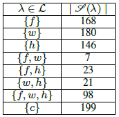

### User study data on human-robot encounters

We ran experiments on a dataset of trajectories collected through an online study where participants had to avoid colliding with a robot in a shared environment, and where the participants depicted 3 behaviors: being in a hurry, taking a normal walk, or maximizing safety (see [video](../video/video.mp4)).

We collected a total of 900 trajectories (50 participants x 6 trials x 3 motivations). After filtering out outliers, we used 842 trajectories. Raw trajectories can be found in the folder `raw_trajectories`.
Since participants may have different conceptions and descriptions of the different behaviors, we notice some overlaps in the trajectories they depict. Indeed, some participant's trajectories under the "carrying something fragile" mode might overlap the behavior of participants when they are “taking a normal walk”. Therefore, we want to associate these multiple labels to such trajectories.
The dataset is composed as follows (where 'f' is the "safety first" motivation, 'w' is the "taking a walk" motivation and 'h' is the "being in a hurry" motivation):

The processed trajectories can be found in the `user_study_data` folder:
* `dict_classes_trajectory.pkl`: pickle object containing a python dict identifying classID as key, and trajectoryID as value.
* `dict_trajectories.pkl`: pickle object containing a python dict identifying trajectoryID as key, and trajectories as value. A trajectory is a list of values [x_val,y_val], where each list of value represents the value of a trajectory at a given discrete time.
* `dict_trajectories_classes.pkl`: pickle object containing a python dict identifying trajectoryID as key, and list of classes as value.
* `list_classes.pkl`: pickle object containing a list of the different classes trajectories can belong to.